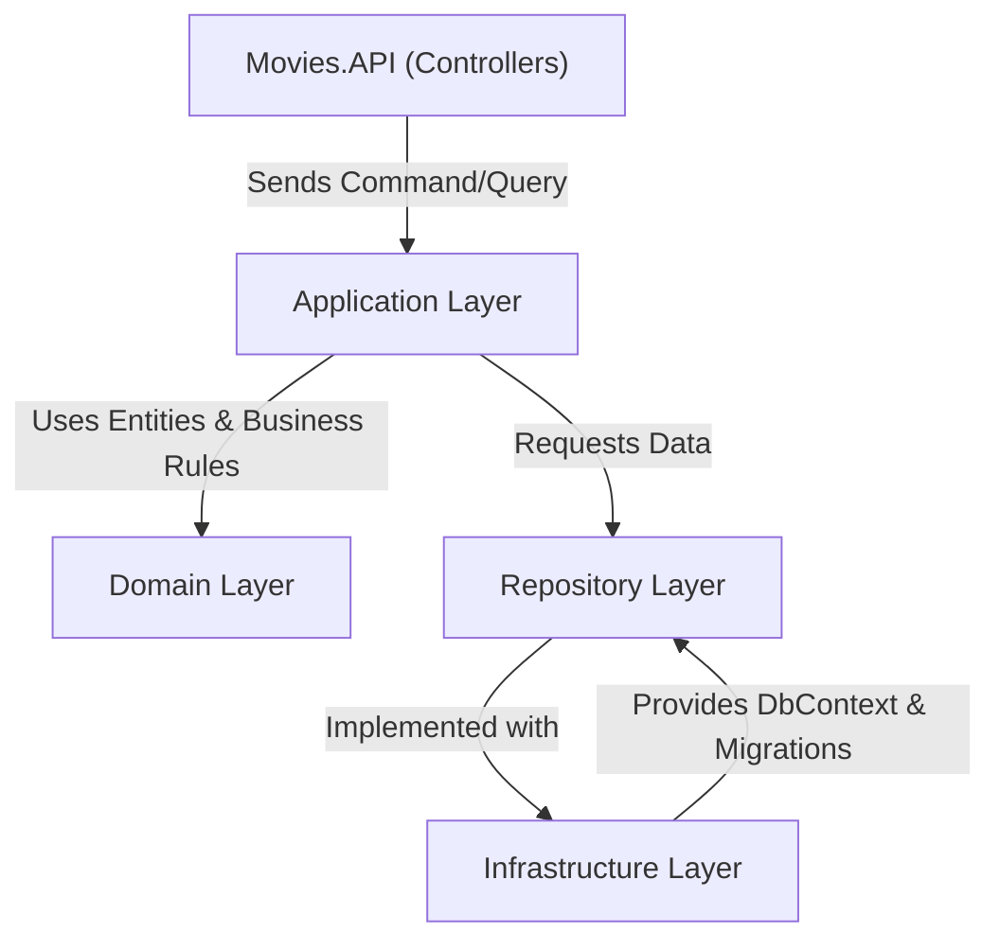

# Movies.API

## Project Architecture

This solution follows a **Clean Architecture / Onion Architecture** approach with separation of concerns across multiple layers:

- **Movies.API (Presentation Layer)**  
  - ASP.NET Core Web API project.
  - Handles HTTP requests and responses.
  - Registers middlewares (exception handling, CORS, caching, authentication, etc.).
  - Configures Dependency Injection.
  - Maps endpoints to MediatR commands/queries.

- **Application Layer**  
  - Contains business use cases and application logic.
  - Uses **CQRS** with **MediatR** to handle commands and queries.
  - Integrates **FluentValidation** for input validation.
  - Uses **DTOs** and **mappings** via **AutoMapper**.
  - Never directly accesses the database.

- **Domain Layer**  
  - Contains the core business model and rules.
  - Defines **entities**, **value objects**, and **domain services**.
  - Contains business logic methods.
  - Independent of frameworks and external libraries.

- **Repository Layer**  
  - Defines repository interfaces and EF Core entity mappings (Configurations).
  - Contains concrete implementations for database access.
  - Works with **DbSet<TEntity>** for CRUD operations.

- **Infrastructure Layer**  
  - Handles technical concerns (persistence, external services, configuration).
  - Contains the **DbContext** and **EF Core migrations**.
  - Registers repositories and other infrastructure services in DI.

---

## Layer Interaction Diagram



---

## Dependency Injection Setup

- **Movies.API**  
  - Registers middlewares.
  - Adds AutoMapper profiles from Application.
  - Adds MediatR handlers from Application.
  - Adds FluentValidation validators from Application.
  - Calls extension methods from Infrastructure and Repository for service registration.

- **Repository**  
  - Provides `AddRepositories(IServiceCollection)` extension method.
  - Registers repository implementations with their interfaces.

- **Infrastructure**  
  - Provides `AddInfrastructure(IServiceCollection, IConfiguration)` extension method.
  - Registers `DbContext`, migrations, and persistence configurations.

---

## AutoMapper

- Installed in **Application**.
- Profiles are defined in the Application layer.
- Registered in `Program.cs` of Movies.API:

```csharp
builder.Services.AddAutoMapper(cfg => cfg.AddProfile<MapperConfig>());
```

---

## MediatR

- Installed in **Application**.
- Commands and Queries defined as **records** for immutability.
- Handlers implemented in Application.
- Registered in `Program.cs`:

```csharp
builder.Services.AddMediatR(cfg => cfg.RegisterServicesFromAssembly(Assembly.GetExecutingAssembly()));
```

---

## FluentValidation

- Validators live in **Application**.
- Registered via reflection scanning:

```csharp
builder.Services.AddValidatorsFromAssembly(Assembly.GetExecutingAssembly());
```

- Integrated with MediatR pipeline to validate before executing handlers.

---

## Middlewares

- **ValidationExceptionMiddleware**: catches validation errors and returns structured responses.
- Registered early in the pipeline in Movies.API:

```csharp
app.UseMiddleware<ValidationExceptionMiddleware>();
app.UseCors();
app.UseOutputCache();
app.UseAuthentication();
app.UseAuthorization();
```

---

## Example Flow: Create User

1. **API Controller** receives `POST /users` request.
2. Maps request body to `CreateUserCommand`.
3. MediatR sends command to its handler.
4. Handler applies business rules (Domain).
5. Handler uses repository interface to persist data.
6. Infrastructure executes EF Core save via DbContext.
7. Response returned as DTO to API.

---

## Technologies Used

- **ASP.NET Core Web API** (Presentation)
- **Entity Framework Core** (Persistence)
- **MediatR** (CQRS + Mediator pattern)
- **FluentValidation** (Validation)
- **AutoMapper** (Object mapping)
- **Dependency Injection** (Microsoft.Extensions.DependencyInjection)


---

