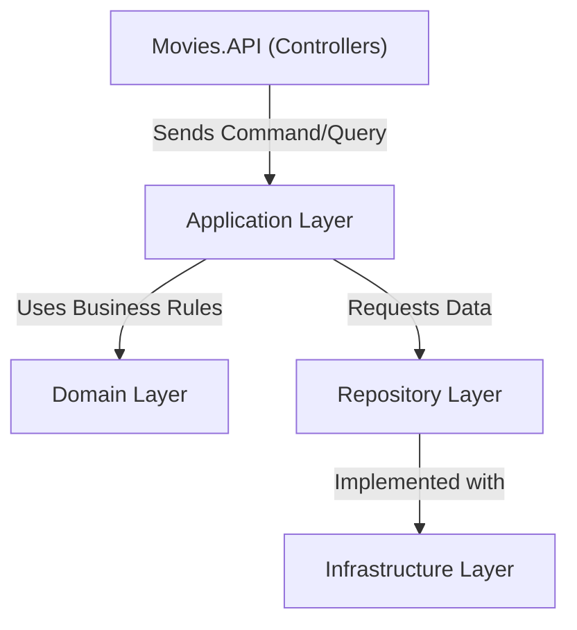

# Movies.API

## Project Architecture

This solution follows a **Clean Architecture / Onion Architecture** approach with separation of concerns across multiple layers:

- **Movies.API (Presentation Layer)**  
  - ASP.NET Core Web API project.
  - Handles HTTP requests and responses.
  - Registers middlewares (exception handling, CORS, caching, etc.).
  - Configures Dependency Injection.
  - Exposes HealthCheck endpoints and UI.
  - Maps endpoints to MediatR commands/queries.

- **Application Layer**  
  - Contains business use cases and application logic.
  - Uses **CQRS** with **MediatR**.
  - Integrates **FluentValidation**.
  - Uses **DTOs** and **AutoMapper**.

- **Domain Layer**  
  - Core business logic, entities, and rules.
  - Independent of frameworks.

- **Repository Layer**  
  - Data access abstractions and implementations.

- **Infrastructure Layer**  
  - External services:
    - Entity Framework Core
    - Azure Blob Storage
    - RabbitMQ
    - Polly (resilience)
    - HealthChecks

---

## Layer Interaction Diagram


```mermaid
graph TD
    A["Movies.API (Controllers)"] -->|Sends Command/Query| B["Application Layer"]
    B -->|Uses Business Rules| C["Domain Layer"]
    B -->|Requests Data| D["Repository Layer"]
    D -->|Implemented with| E["Infrastructure Layer"]
```

---

## Running the Project

### 1. Configure settings

Copy example config:

```bash
cp appsettings.Example.json appsettings.Development.json
```

Update values:

- Database connection
- Azure Storage connection string
- RabbitMQ credentials

---

### 2. Run RabbitMQ (Docker)

A `docker-compose.yaml` file is included.

Update credentials:

```yaml
environment:
  RABBITMQ_DEFAULT_USER: your_username
  RABBITMQ_DEFAULT_PASS: your_password
```

Run container:

```bash
docker-compose up -d
```

RabbitMQ will be available at:

- UI → http://localhost:15672
- AMQP → localhost:5672

---

### 3. Run the API

```bash
dotnet run
```

---

## Health Checks

Health checks monitor external dependencies:

- Azure Blob Storage
- RabbitMQ

### Endpoints

- `/health` → JSON status
- `/health-ui` → Dashboard UI

---

## RabbitMQ Integration

- Uses async API (`RabbitMQ.Client`)
- Configured via `RabbitMqSettings`

```csharp
services.AddSingleton<ConnectionFactory>(...);
services.AddSingleton<IMessagePublisher, RabbitMqPublisher>();
```

---

## Polly (Resilience)

```csharp
services.AddSingleton<IAsyncPolicy>(RetryPolicies.DefaultRetry);
```

Used for retry handling in external services.

---

## Azure Blob Storage

Supports multiple containers:

```json
"Containers": {
  "Movies": "movies",
  "Actors": "actors"
}
```

Recommended:

```json
"HealthCheckContainer": "movies"
```

---

## Technologies Used

- ASP.NET Core Web API
- Entity Framework Core
- MediatR
- FluentValidation
- AutoMapper
- RabbitMQ
- Azure Blob Storage
- Polly
- HealthChecks
- Docker

---

## Observability & Reliability

- Health checks for external services
- Retry policies with Polly
- Background processing with RabbitMQ
